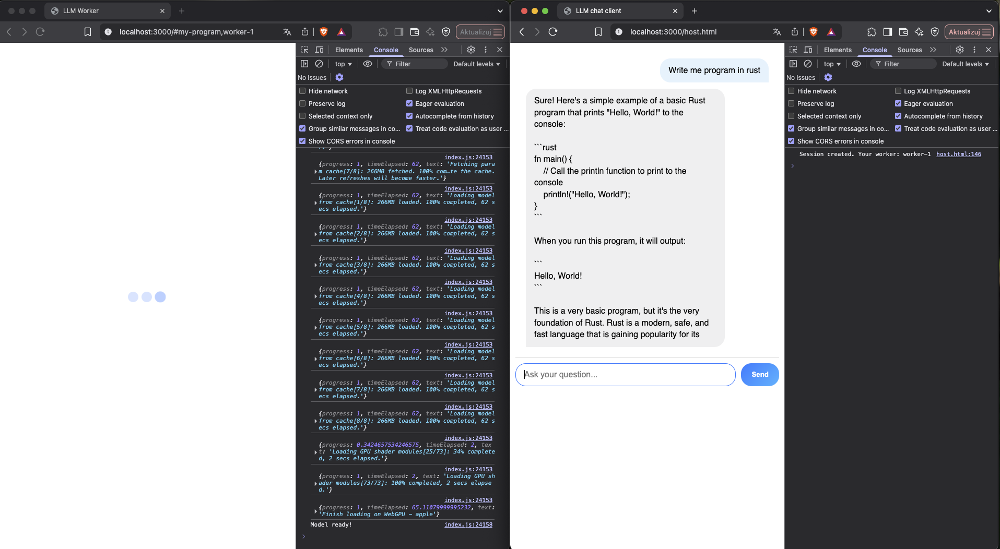

# webllm-sallar-example

## Description

Simple example of llm chat that can be run on [sallar network](https://sallar.io/).

Project is based on [@sallar-network/server](https://github.com/NERVE-labs-team/sallar-network-server-library) and [@sallar-network/client](https://github.com/NERVE-labs-team/sallar-network-client-library). It uses provided libraries to create a simple client-server model.

* The **server** part (`src`) is a simple HTTP server. It serves the program, communicates with our network, allows you to send commands to individual program instances and collect the results of work.

* The **client** part is the program itself executed in multiple instances by browsers.

At the current stage of development of the project in order to release the program on our network, it is necessary to host the server on a publicly available server on your own.

You can test the network locally by setting the `DEV_MODE` flag.

## Configuration

```env
PORT=[PORT]
DEV_MODE=[true/false] # set to true for local testing

# Required when you push your app to production
PROGRAM_TOKEN=[PROGRAM_TOKEN]
NODE_MANAGER_SERVER=[NODE_MANAGER_SERVER]
```

Put configuration in the system vars or `.env` file.

## Running the app locally

```bash
# install all packages
$ npm run bootstrap

# dev mode
$ npm run dev

# prod mode
$ npm run start
```

Url will be used by our network in the following form:

```
{signed_url},{worker_id}
```

where signed url means:

```
{url}#{program_id}
```

**To test locally you can mock these values**:

AI Workers:

```
http://localhost:3000/#my-program,worker-1
http://localhost:3000/#my-program,worker-2
etc.
```

Chat client:

```
http://localhost:3000/host.html
```

## Demo

<p align="center">

</p>

## Running the app in production

Coming soon!
